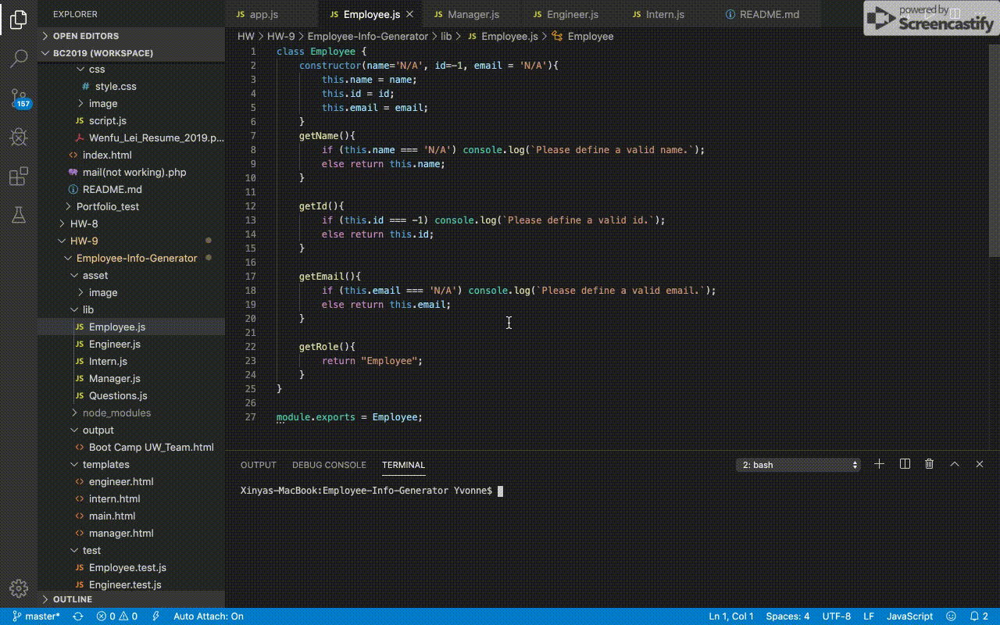
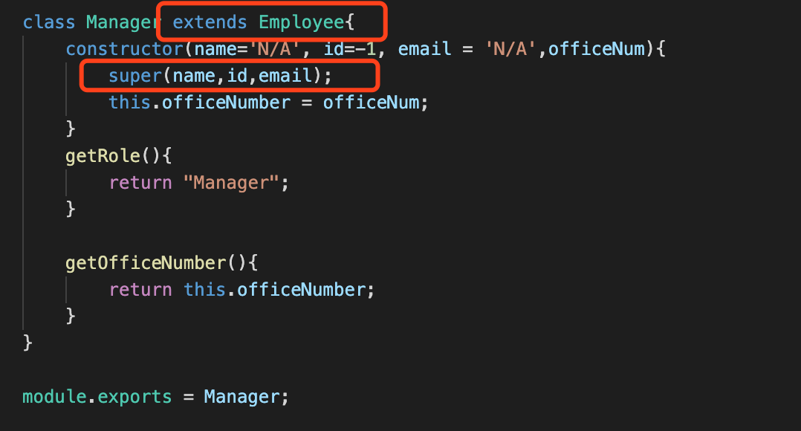

# Employee-Info-Generator

## Description

Writing code that is readable, reliable and maintainable is critical and practical for an experienced programmer. If we have a template that can take different user inputs to auto generate outputs, it would be much more efficient and practical. In this project, I am building a Node CLI that takes in information about employees and generaes an HTML file that displays summaries for each person according to their position. In order to be maintainable and reusable, I am using TDD and OOP to build up this engine template.

Here is how the command-line application being built as below:
1. Define Object class js files to pass the cooresponding test for the further OOP.
2. The application will prompt the user for information about the team manager and then information about the team members. The user can input any number of team members, and they may be a mix of engineers and interns.
3. After finishing adding member, looping the member-object array and transferring its information into its cooresponding html and being appended onto the main.html
4. Output the main html into a customized html

### Demo

##### TDD Demo

##### OOP Demo

In the process of building application, I have learned:
* Utilize Github repository, familiarize git commands to save all my works onto github

* Familiarize the basic html commands to build the full contents of the site

* Familiarize utilizing <b>node.js</b>, especially:
    * researching various npm
    * inquirer npm -- ask user questions
    * util npm -- generate new promise
    * fs npm -- read/write file
    * cherrio npm -- implementation of core jQuery designed specifically for the server

* Familiarize using npm testing to build up OOP (TDD)

* First time using validate function in inquirer npm to verify the user input

* Utilizing class extends to avoid "DRY" situation in OOP.

## Credits 

I am here to acknowlage to the Coding Bootcamp of University of Washington along with below falcuties:
* Jason Rosen (Instructor)
* Daniel Mont-Eton (TA)
* Kris Shore (TA)

## License
MIT License

Copyright (c) [2019] [Norman Lei]

Permission is hereby granted, free of charge, to any person obtaining a copy
of this software and associated documentation files (the "Software"), to deal
in the Software without restriction, including without limitation the rights
to use, copy, modify, merge, publish, distribute, sublicense, and/or sell
copies of the Software, and to permit persons to whom the Software is
furnished to do so, subject to the following conditions:

The above copyright notice and this permission notice shall be included in all
copies or substantial portions of the Software.

THE SOFTWARE IS PROVIDED "AS IS", WITHOUT WARRANTY OF ANY KIND, EXPRESS OR
IMPLIED, INCLUDING BUT NOT LIMITED TO THE WARRANTIES OF MERCHANTABILITY,
FITNESS FOR A PARTICULAR PURPOSE AND NONINFRINGEMENT. IN NO EVENT SHALL THE
AUTHORS OR COPYRIGHT HOLDERS BE LIABLE FOR ANY CLAIM, DAMAGES OR OTHER
LIABILITY, WHETHER IN AN ACTION OF CONTRACT, TORT OR OTHERWISE, ARISING FROM,
OUT OF OR IN CONNECTION WITH THE SOFTWARE OR THE USE OR OTHER DEALINGS IN THE
SOFTWARE.

Ajax Autocomplete for jQuery is freely distributable under the terms of an MIT-style license.
Copyright notice and permission notice shall be included in all copies or substantial portions of the Software.

